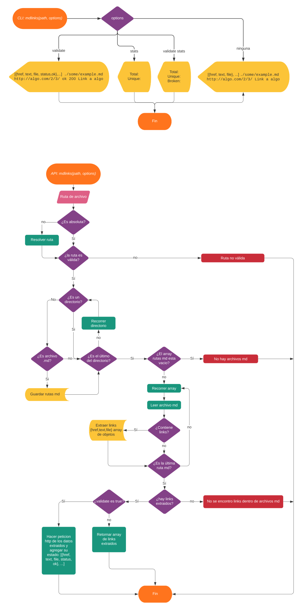

# Markdown Links

## Índice

- [Preámbulo](#preámbulo)
- [Sobre el proyecto](#sobre-el-proyecto)
  - [Descripción](#sobre-el-proyecto)
  - [Diagrama de Flujo](#diagrama-de-flujo)
  - [Licencia](#licencia)
- [Guía de Uso](#guía-de-uso)
  - [Instalación](#instalación)
  - [Librería](#utilizalo-como-librería)
  - [Interfaz de Línea de Comando](#utilizalo-como-interfaz-de-línea-de-comando)

---

## Preámbulo

[Markdown](https://es.wikipedia.org/wiki/Markdown) es un lenguaje de marcado ligero muy popular entre developers. Es usado en muchísimas plataformas que manejan texto plano (GitHub, foros, blogs, ...), y es muy común encontrar varios archivos en ese formato en cualquier tipo de repositorio (empezando por el tradicional `README.md`).

Estos archivos `Markdown` normalmente contienen _links_ (vínculos/ligas) que muchas veces están rotos o ya no son válidos y eso perjudica mucho el valor de la información que se quiere compartir.

Dentro de una comunidad de código abierto, nos han propuesto crear una herramienta usando [Node.js](https://nodejs.org/), que lea y analice archivos en formato `Markdown`, para verificar los links que contengan y reportar algunas estadísticas.

---

## Sobre el proyecto

md-links es una librería desarrollada con [Node.js](https://nodejs.org/es/), que permite extraer los links dentro de cada archivo `Markdown(.md)`. Además, permite obtener estadísticas y validar el estado del link (si esta roto o es válido).

### Diagrama de Flujo


### Licencia
&copy; 2021 Anghel Trillo licencia MIT.

## Guía de Uso

### Instalación
Instala la librería con npm:

```bash
npm i am27th-mdlinks
```

Instala la librería con github:
```bash
npm install AM27TH/LIM015-md-links
```
### Utilizalo como Librería

```js
const mdlinks = require('am27th-mdlinks');
```

Exporta la función mdLinks(\<path>,\<options>) este retorna una promesa, donde se resuelve un array de objetos, en caso de fallar devolverá el error.

##### Parámetros:
- path: (string) Ruta absoluta o relativa al archivo o directorio de donde se invoca.
- options: (objeto) con las siguiente propiedad:
  - validate: (bool) que determina si se desea validar los links encontrados.
    - false: retorna un array de objetos con 4 propiedades.
      ```js
        [
          {
            href, //(string) link
            path, //(string) ruta relativa
            text, //(string) texto
            line  //(int) linea
          }
        ]
      ```
    - true: retorna un array de objetos con 6 propiedades, cuando se valida el estado del link.
      ```js
          [
            {
              href, //(string) link
              path, //(string)ruta relativa
              text, //(string)texto
              line, //(int) linea
              status, //(int) estado del link
              ok //(bool) estado del link
            }
          ]
        ```

##### Ejemplo de uso:
```js
mdlinks("./some/example.md", { validate: false })
  .then(links => {
    // => [{ href, text, file }]
  })
  .catch(console.error);

mdlinks("./some/example.md", { validate: true })
  .then(links => {
    // => [{ href, text, file, status, ok }]
  })
  .catch(console.error);
```
---

### Utilizalo como Interfaz de Línea de Comando

El ejecutable de nuestra aplicación se ejecuta de la siguiente manera a través de la **terminal**:

`md-links <path-to-file> [options]`

Por ejemplo:

```bash
$ md-links ./some/example.md
./some/example.md https://github.com/ GitHub 2
./some/example.md https://fabook.c/ Facebook 6
./some/example.md http://google.com/x Google 10
```

El comportamiento por defecto no valida las URL, solo debe identifica el archivo markdown (a partir de la ruta que recibe como argumento), analiza el archivo e imprime los links que vaya encontrando, junto con la ruta del archivo donde aparece, el texto que hay dentro del link (truncado a 50 caracteres) y la línea del archivo donde lo encontró.

#### Options

##### `--validate`

Si pasamos la opción `--validate`, el módulo debe hacer una petición HTTP para averiguar si el link funciona o no. Si el link resulta en una redirección a una URL que responde ok, entonces consideraremos el link como ok.

Por ejemplo:

```bash
$ md-links ./some/example.md --validate
./some/example.md https://github.com/ ok 200 GitHub 2
./some/example.md https://fabook.c/ fail noStatus Facebook 6
./some/example.md http://google.com/x fail 404 Google 10
```

Vemos que el _output_ en este caso incluye la palabra `ok` o `fail` después de
la URL, así como el status de la respuesta recibida a la petición HTTP a dicha
URL.

##### `--stats`

Si pasamos la opción `--stats` el output (salida) será un texto con estadísticas
básicas sobre los links.

```bash
$ md-links ./some/example.md --stats
Total: 3
Unique: 3
```

También podemos combinar `--stats` y `--validate` para obtener estadísticas que necesiten de los resultados de la validación.

```bash
$ md-links ./some/example.md --stats
Total: 3
Unique: 3
Broken: 2
```
---
